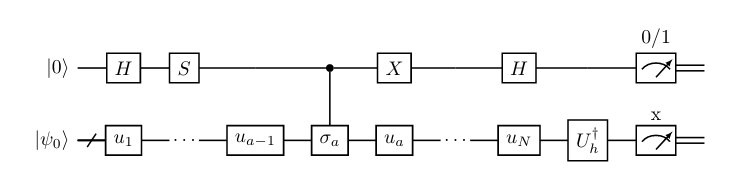
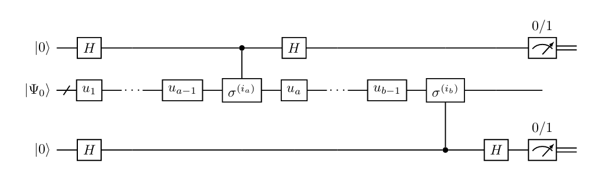
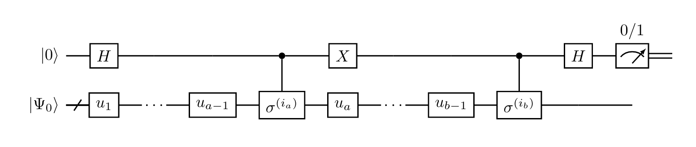

# Theoretical Background

We search for the wave function of the ground state  in the form


where  stands for the initial guess of the wave function and


In the simplest case,  designates the one qubit rotation and expresses as


In order to find the parameters  one can use the imaginary time evolution (ITE) method.
Within this approach, the application of the  to the wave function  is equivalent to the following change of the parameters 


where  is found from the equation


Here


and


The coefficients  and  can be evaluated with the use of a quantum computer as follows.
First, let us decompose the Hamiltonian into a sum of Pauli strings (PS)


As a next step, one needs to evaluate the derivative with respect to the parameter .
In the simplest case, when  stands for the one qubit rotations, one obtains


Utilizing this expression and the decomposition of the Hamiltonian into PS, one can show that


where  is the diagonal matrix and probabilities  are obtained as a result of measurement of the following circuit



This circuit differ from one presented in the paper by McArdle with co-authors by the absence of one controlled operation. 
Instead, one needs to perform additional postprocessing, namely, evaluate the average of the diagonal matrix, i.e. only calculate the sign of the contribution.

**Note:** not all  have to be measured. The results for the Pauli strings differing by the replacement of Z Pauli matrices with identity matrices can be obtained from the single measurement.

Similarly, one can show that 


where the probabilities are obtained from measuring the circuit



Note that in this circuit there are two ancilla qubits that differ from one ancilla qubit variant presented in the paper by McArdle with co-authors. The use of two ancilla qubits instead of one allows one to sufficiently relax the requirements on the connectivity of the qubits in the quantum processor. In the case when both derivatives act on the parameters corresponding to the same qubit, one needs to utilize the original scheme. 



The matrix elements are given by


# Notes

To launch the code type:
```shell
python prog.py file.inp
```

The structure of the ```file.inp``` is following

```
OBI = z115_1-int.txt
TBI = z115_2-int.txt
Nelec = 5
Parity = 1
norb = 8
ansatz_tp = 0
Nlayers = 3
rot = [2]
Q_on = False
noise_off = True
Nrep = 1
```

Note that the parity should be fixed in advance. Only the ```ansatz_tp=0``` is currently available. The keys ```Q_on```, ```noise_off```, and ```Nrep``` are currently unavailable.


# References 

S. McArdle, T. Jones, S. Endo, Y. Li, S.C. Benjamin, and Xiao Yuan,
''Variational ansatz-based quantum simulation of imaginary time evolution'',
[npj Quantum Inf. 5, 75 (2019)](https://www.nature.com/articles/s41534-019-0187-2)

J. Stokes, J. Izaac, N. Killoran, and G. Carleo,
''Quantum Natural Gradient'',
[Quantum 4, 269 (2020)](https://quantum-journal.org/papers/q-2020-05-25-269/)

D. Wierichs, C. Gogolin, and M. Kastoryano,
''Avoiding local minima in variational quantum eigensolvers with the natural gradient optimizer'',
[Phys. Rev. Res. 2, 043246 (2020)](https://journals.aps.org/prresearch/abstract/10.1103/PhysRevResearch.2.043246)

D.P. Kingma and J. Ba,
''Adam: A Method for Stochastic Optimization'',
[arXiv:1412.6980](https://arxiv.org/abs/1412.6980)